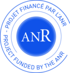

# bpmn-models
some bpmn models, home-made or taken from the literature

If you use the models, please refer to the original publication when available. The objective is only to have a place with some models for evaluation purposes, not to get credit for others' work.

This repository takes its origin as a side-effect of the [PARDI project](http://pardi.enseeiht.fr), funded by the French National Agency for Research.

